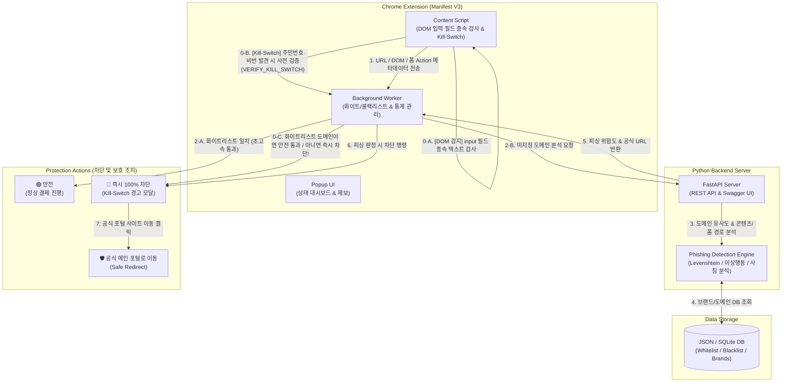

# 🎣 GetFish: 온라인 결제 피싱 및 사칭 사이트 차단 솔루션
**"안전한 결제의 시작, 가짜 사이트를 낚아채다(Get Fish)"**

---

## 1. 프로젝트 개요 (Overview)
- **프로젝트명:** GetFish (겟피쉬)
- **한 줄 요약:** 온라인 결제 및 쇼핑 시 피싱·유사 도메인(Typosquatting)을 실시간으로 감지하고, 진짜 공식 사이트로 안내하는 Chrome 확장 프로그램
- **개발 동기 및 배경:**
  - 최근 네이버페이, 쿠팡, 토스페이먼츠, PG사(이니시스, KCP 등)를 사칭한 가짜 결제/쇼핑몰 사이트를 통한 금융 사기가 급증하고 있음.
  - 기존 백신이나 일반 웹 필터링은 '신규 생성된 사칭 도메인(Zero-day Phishing)'이나 '정밀한 오타 도메인(예: `navr-pay.com`, `c0upang.kr`)'을 즉각 차단하는 데 한계가 있음.
  - 사용자가 피싱 사이트임을 인지하지 못한 채 결제 정보(카드번호, 계좌 등)를 입력하는 순간을 적극적으로 방어하고, **"진짜 안전한 사이트로 리다이렉트"** 해주는 실질적 보호 장치가 필요함.

---

## 2. 목표 및 핵심 타겟 (Goal & Target)
- **핵심 목표 (Internship MVP Goal):**
  - **2026년 8월 14일 전까지** 핵심 피싱 탐지 엔진 및 크롬 확장 프로그램 프로토타입(MVP) 개발 완료
  - 인턴십 평가 및 데모 발표를 위한 **"실시간 피싱 감지 ➔ 경고 오버레이 차단 ➔ 공식 사이트 이동"** 엔드투엔드(End-to-End) 데모 시나리오 완벽 구현
- **주요 타겟 사용자:**
  - 온라인 쇼핑몰 및 간편결제를 자주 이용하는 일반 소비자
  - 부모님, 고령층 등 디지털 기기 취약계층 및 피싱 사기에 노출되기 쉬운 사용자

---

## 3. 주요 기능 정의 (Features)

### 📌 MVP (최소 기능 제품) 범위
1. **기능 A: 결제/쇼핑 페이지 감지 및 하이브리드 피싱 판별 엔진 (4단계 검증)**
   - **페이지 인지 및 입력 필드 종속 검증 (Input-Associated DOM Scanning):** URL 키워드(`checkout`, `payment`, `order`, `pay` 등) 및 DOM 내 사용자 입력 필드(`<input>` 텍스트, 비밀번호, 전화번호 등) 감지 시 자동 분석 활성화. *단순 문단(`
`, `
`)에 언급된 단어는 무시하여 뉴스 기사, 블로그, 위키백과 등에서의 오진(False Positive)을 100% 방지.*
   - **1단계 (Whitelist Check):** 네이버페이 전 영역(`naver.com`, `pay.naver.com`, `orders.pay.naver.com`), 카카오페이, 토스, PG사 등 공식 결제 도메인뿐만 아니라 **정부/공공/금융 포털(`gov.kr`, `hometax.go.kr`)**, **검색엔진(`google.com`, `daum.net`)**, **주요 언론사(`news.naver.com`)** 등 60여 개 검증된 화이트리스트와 일치 시 즉시 "안전(Safe)" 판정 (초고속 통과)
   - **2단계 (Blacklist Check):** KISA 보호나라 및 금융업계 신고 패턴 기반의 30여 개 고위험 스미싱/타이포스쿼팅 사칭 도메인(`naevr.com`, `c0upang-sale.kr`, `toss-pay-auth.kr`, `inicis-pay-safe.net` 등) 매칭 시 즉시 차단
   - **3단계 (유사 도메인 탐지 - Typosquatting):** 
     - 레벤슈타인 거리(Levenshtein Distance) 및 문자열 유사도 알고리즘을 사용하여 공식 브랜드 도메인과의 오타/유사도 분석 (예: `toss-pay-auth.kr` ➔ `toss.im` 사칭 의심)
   - **4단계 (비유사 도메인 사칭 및 이상 행동 감지 - 예외 처리 및 보완):**
     - **① 민감 개인금융정보 요구 감지 (Kill-Switch & 사전 화이트리스트 검증):** 정상적인 온라인 PG사 결제창에서는 절대 직접 요구하지 않는 **'주민등록번호(전체/뒷자리)', '카드 비밀번호(4자리 전체)', '계좌 비밀번호', '공동인증서 비밀번호'** 입력을 유도하는 `<label>`이나 `<input>` 필드(300자 이내 입력 폼 상자)가 감지될 경우, 백그라운드 워커에 0.001초 만에 화이트리스트 여부를 사전 질의(`VERIFY_KILL_SWITCH`) 후 외부 비인가 도메인일 시 **즉시 100% 피싱 사이트로 확정하고 즉각 차단(Kill-Switch)**
     - **② 콘텐츠/타이틀 사칭 검증 (Brand Impersonation):** 도메인 문자열이 전혀 다르더라도(예: `secure-pay-deal.com`), 페이지 타이틀이나 본문/헤더에 보호 대상 브랜드 키워드('네이버페이', '쿠팡', '토스' 등)나 로고가 존재하는데 화이트리스트 도메인이 아닌 경우 즉시 사칭 사이트로 판별
     - **③ 결제 폼 전송 경로 이상 감지 (Form Action Anomaly):** 카드 번호 및 결제 정보가 입력되는 `<form action="...">` 주소나 비동기(fetch/XHR) 데이터 전송 IP/도메인이 검증된 공식 PG사 엔드포인트가 아닌 미인가 외부 서버/웹훅으로 향하는지 탐지
     - **④ 신규 생성 도메인 검증 (Zero-Day Phishing):** WHOIS/RDAP 가벼운 조회나 도메인 속성 분석을 통해 생성된 지 30일 미만인 신규 도메인에서 결제 정보를 요구할 시 고위험 가중치 부여

2. **기능 B: 실시간 경고 오버레이 및 공식 사이트 리다이렉션 (Safe Redirect Strategy)**
   - 피싱 위험 감지 시 브라우저 화면 전체에 직관적이고 강력한 **[🚨 피싱 차단 경고 모달]** 주입 (Glassmorphism 디자인 적용)
   - **안전 리다이렉트 전략(Safe Redirect):** 불법 복제되거나 애초에 존재하지 않는 가짜 결제 세션을 강제 종료하고, 사칭 대상 브랜드(예: 네이버페이, 토스, 쿠팡)를 자동 식별하여 **"해당 브랜드의 공식 메인 홈페이지(`https://pay.naver.com`, `https://toss.im`)"**로 안내. 이를 통해 사용자는 안전한 공식 환경에서 본인의 실제 결제·주문 내역을 직접 대조하고 안심할 수 있음.
   - 구체적 위험 이유 명시 (예: *"도메인 이름은 다르지만 네이버페이를 사칭하고 있으며, 결제 정보가 외부 비정상 서버로 전송되고 있습니다."*)

3. **기능 C: 확장 프로그램 팝업 상태바 (Status UI) & 실시간 제보 시스템**
   - **현재 활성 탭 실시간 동기화 (Active Tab Real-Time Sync):** 팝업 아이콘 클릭 시 전역 메모리에 저장된 과거 주소가 아닌, 브라우저에서 사용자가 현재 보고 있는 **활성 탭(Active Tab)의 도메인을 즉시 조회**하여 해당 페이지의 실시간 안전 상태(🟢 안전 / 🟡 주의 / 🔴 위험)를 1:1로 정확하게 매핑하여 표시
   - **크라우드 소싱 기반 실시간 의심 사이트 제보 (Crowd-Sourcing Report API):** 단순 UI 껍데기가 아닌 백엔드 REST API(`POST /api/report`)와 100% 실시간 연동! 사용자가 **[🚨 의심 사이트 제보하기]** 클릭 시 현재 활성 탭의 URL 및 도메인 메타데이터가 백엔드 감시 서버 영구 대기열(`data/reports.json`)로 전송되어 기록됨
   - **[관리자 대응 4단계 표준 프로세스 (SOP)]:** 악의적인 경쟁사 음해 및 정상 사이트 오탐(False Positive) 방지를 위해 **Human-in-the-Loop (사람이 개입하는 최종 승인 체계)** 수립:
     1. **제보 모니터링:** `GET /api/reports` REST API를 통해 미검수 대기열(`status: "pending_verification"`) 실시간 조회
     2. **2단계 안전 검증:** 도메인 사칭 여부 및 가상 환경(Sandbox)에서 과도한 개인·금융정보 요구 여부 실무 검증
     3. **블랙리스트 DB 실시간 동기화:** `blacklist.json`에 도메인 추가 시, 전 세계 GetFish 사용자들에게 **실시간 전역 차단(🔴 피싱 위험 차단됨)** 즉시 동기화
     4. **위협 인텔리전스 공유:** KISA(한국인터넷진흥원 보호나라 118) 및 구글 세이프 브라우징에 피싱 URL 신고 및 도메인 차단 요청
   - 보호한 피싱 사이트 누적 횟수 통계 및 백엔드 검증 서버(`localhost:8000`)와의 실시간 연결 상태 모니터링

### 📌 추가 예정 기능 (Backlog / Phase 2)
- **🤖 AI 기반 샌드박스 자동 검증 로봇 (Hybrid AI-Human Pipeline):** 대량 제보 발생 시 가상 헤드리스 브라우저가 자동 접속하여 비전 모델/DOM 분석 후, 확신도 99% 이상의 확실한 피싱은 무인 자동 차단하고 70~95%의 고난도 위협만 관리자가 검수하는 자동화 파이프라인
- **📱 모바일 플랫폼 확장 (Cross-Platform Mobile Security):** PC 크롬 확장프로그램의 검증 엔진(FastAPI)을 그대로 활용하여 iOS(Safari Web Extension) 및 안드로이드(삼성 인터넷 애드온 / URL 공유 검증 앱) 플랫폼으로 서비스 확장
- **AI/ML 기반 UI/로고 사칭 탐지:** 웹페이지 캡처 이미지나 로고(OCR/비전 모델)를 분석하여 공식 브랜드 로고를 도용한 경우 탐지

---

## 4. 기술 스택 및 아키텍처 (Tech Stack)

- **Frontend (Chrome Extension):**
  - **Manifest V3:** 최신 구글 확장 프로그램 표준 준수 (`background.js`, `content.js`)
  - **UI/Styling:** Vanilla HTML/JS + **Vanilla CSS** (State-of-the-Art Cybersecurity Premium Glassmorphism 적용: 딥 옵시디언 글래스 블러 25px, 크림슨 레드 네온 글로우 테두리, 레이더 파동 애니메이션 사이렌, 애플/스트라이프 스타일 에메랄드 그라디언트 버튼으로 차세대 사이버 보안 UI 구현)
- **Backend (API Server):**
  - **Language:** Python 3.10+
  - **Framework:** **FastAPI** (비동기 처리 최적화, 자동 API 문서화 `/docs` 제공)
    - `POST /api/analyze` : 웹페이지 피싱 위험도 실시간 하이브리드 검증
    - `POST /api/report` : 의심 피싱 사이트 크라우드 소싱 제보 수신 및 영구 큐(`reports.json`) 기록
    - `GET /reports` : **[v1.0.2 신규]** 관리자 및 사용자를 위한 **실시간 글래스모피즘 의심 피싱 제보 감시 대시보드 (Live Threat Queue UI)**
    - `GET /api/reports` : 관리자용 의심 피싱 사이트 미검수 대기열 조회 API (**블랙리스트 DB와 교차 대조하여 `blocked` 자동 동기화**)
    - `GET /api/stats` : 누적 탐지 통계 및 엔진 상태 조회 (`v1.0.2-hybrid` 통합 엔드포인트)
  - **Algorithm & Rules:** 
    - `Sensitive Data Kill-Switch` (주민등록번호 및 카드 비밀번호 요구 100% 차단)
    - `Levenshtein` / `Jaro-Winkler` (문자열 유사도 기반 오타 도메인 탐지)
    - `Brand Keyword Matching` (비유사 임의 도메인의 브랜드 사칭 탐지)
    - `Form Action / Endpoint Analyzer` (결제 데이터 전송 경로 검증)
- **Database / Storage:**
  - **JSON DB & SQLite (`getfish.db`):** 경량화 및 빠른 프로토타입 구현을 위해 JSON 기반 화이트리스트/블랙리스트, 브랜드 타겟 맵핑, 및 크라우드 소싱 제보 대기열(`reports.json`) 저장
- **Infra / Deploy:**
  - Localhost (MVP 데모용) 또는 Render / Railway / AWS EC2 무료 티어를 활용한 백엔드 배포

### 📱 모바일(Mobile) 환경 확장 전략 (Phase 2 Roadmap)
현재 MVP 단계(~8/14)에서는 **PC Chrome Extension**과 **중앙 집중식 Python FastAPI 백엔드 엔진** 완성 및 검증에 집중하며, 인턴십 완료 후 모바일 환경으로 아래와 같이 쉽게 확장할 수 있는 아키텍처를 취합니다.
1. **iOS (아이폰/아이패드):** Apple Safari는 iOS 15부터 **Safari Web Extension**을 지원하며, Chrome Manifest V3 표준과 거의 100% 호환됩니다. 기존 코드를 Xcode(`safari-web-extension-converter`)를 통해 사파리 확장 프로그램으로 즉시 포팅하여 모바일 사파리 결제창에서 동일하게 동작시킵니다.
2. **Android (갤럭시 등):** 
   - **방안 A (브라우저 애드온):** 국내 점유율이 높은 **삼성 인터넷(Samsung Internet)** 애드온 또는 키위(Kiwi)/레머(Lemur) 등 확장프로그램 지원 모바일 브라우저로 배포
   - **방안 B (URL 공유 검증 모바일 앱):** 사용자가 카카오톡, 문자(스미싱), SNS로 받은 의심스러운 쇼핑몰/결제 링크를 **[공유하기 ➔ GetFish 앱으로 검사]**하면, 백엔드 API가 실시간 검증 후 안전할 때만 브라우저로 연결해주는 모바일 전용 앱 출시

---

## 5. 화면 및 서비스 흐름 (UX/UI Flow)

### 🌊 User Flow (사용자 흐름)
1. **[결제/쇼핑 사이트 접속]**: 사용자가 결제 페이지(예: 스마트스토어 결제창 또는 사칭 사이트)에 접근
2. **[실시간 백그라운드 검증]**:
   - 확장 프로그램이 URL과 페이지 내 결제 폼(카드 입력 등)을 감지
   - 화이트리스트(공식 사이트)인 경우 ➔ 🟢 **정상 진행 (아무 간섭 없음, 팝업에 '안전' 표시)**
   - 유사 도메인 또는 블랙리스트인 경우 ➔ 🔴 **피싱 탐지 트리거**
3. **[차단 및 보호 조치 (Intervention)]**:
   - 웹페이지 상단/전체에 **풀스크린 경고 오버레이(Glassmorphism Red Alert)** 자동 생성
   - 결제 폼 입력을 막아 카드 정보 유출 차단
4. **[안전 리다이렉트 전략 (Safe Redirect Strategy)]**:
   - 사용자가 **[🛡️ 공식 안전 웹사이트로 이동하기]** 버튼 클릭
   - 불법 복제되거나 애초에 존재하지 않는 가짜 결제 세션을 강제 종료하고, 사칭하던 본래의 공식 메인 홈페이지(`https://pay.naver.com`, `https://toss.im`, `https://www.coupang.com` 등)로 안전하게 이동
   - 사용자는 공식 플랫폼에 로그인하여 **"본인의 실제 결제·주문 내역에는 아무런 이상이 없음"**을 직접 확인하고 안심할 수 있음.
5. **[크라우드 소싱 제보 및 자동 동기화 (Crowd-Sourcing Auto-Sync)]**:
   - 확장 프로그램 팝업의 **[🚨 의심 사이트 제보하기]** 클릭 시 서버 제보 대기열에 실시간 접수 (`status: "pending_verification"`)
   - 사용자와 관리자는 **`/reports` 글래스모피즘 대시보드**에서 접수 내역, 상대 시간, 도메인 복사 버튼을 통해 모니터링 가능
   - 관리자가 확인 후 `backend/data/blacklist.json`에 도메인을 추가하고 push하면, 별도 수정 없이 서버가 교차 대조하여 제보 대기열의 상태를 **`🔴 전역 차단 완료 (Blocked)` 배지로 100% 자동 변환**

---

## 6. 개발 및 버전 배포 현황 (Current Status: v1.0.2 출시)

| 버전 | 배포 일자 | 핵심 업데이트 내역 | 배포 상태 |
| :--- | :--- | :--- | :--- |
| **v1.0.0** | 2026-07-06 | Chrome Web Store 최초 출시 (Manifest V3, 4단계 하이브리드 엔진) | 웹스토어 심사 완료/게시 |
| **v1.0.1** | 2026-07-08 | 백엔드 API 버전 동기화 및 Kill-Switch 로직 폴리싱 | 로컬 및 클라우드 검증 |
| **v1.0.2** | **2026-07-09** | **[최신 프로덕션 배포]** • **글래스모피즘 제보 대시보드(`/reports`) 신규 런칭** • `blacklist.json` 추가 시 제보 대기열 `blocked` 자동 동기화 로직 적용 • 중복 `/api/stats` API 단일 통합 및 UI/UX 전면 개편 | **Render 클라우드 및 Web Store 패키징 완료** |

> 💡 **[중요 안내] 로컬 데모 HTML(`file://`) 시연 시 주의사항**
> * 크롬 웹스토어에서 정식 다운로드한 확장 프로그램은 보안 정책상 로컬 컴퓨터 파일(`file://.../naver_pay_phishing.html`)에 대한 접근이 기본 차단(`OFF`)됩니다.
> * 실제 인터넷 사이트(`http://`, `https://`)에서는 권한 설정 없이 즉시 작동하며, 인턴십 심사위원이 **로컬 데모 HTML 파일**로 테스트할 때만 `chrome://extensions` ➔ GetFish **[세부정보]** ➔ **[파일 URL에 대한 액세스 허용]을 ON**으로 켜야 작동합니다.

---

## 7. 개발 일정 (Timeline: ~8/14 인턴십 종료 전)

| 주차 | 기간 (예시) | 핵심 목표 및 상세 태스크 |
| :--- | :--- | :--- |
| **1주차** | 7/06 ~ 7/12 | **기획 구체화 및 환경 세팅** • 프로젝트 계획서 확정 및 아키텍처 설계 • Chrome Extension Manifest V3 기본 보일러플레이트 구성 • FastAPI 백엔드 프로젝트 세팅 및 JSON DB 구조 설계 |
| **2주차** | 7/13 ~ 7/26 | **핵심 엔진 & 기능 구현 (Sprint)** • Python 도메인 유사도 분석 알고리즘(Levenshtein) 및 API 구현 • 화이트리스트/블랙리스트/브랜드 타겟 데이터셋(50개 주요 쇼핑/PG사) 구축 • Content Script DOM 감지 및 피싱 차단 오버레이 UI 구현 |
| **3주차** | 7/27 ~ 8/05 | **프로토타입 통합 및 데모 시나리오 제작** • Frontend ↔ Backend API 통신 연동 및 상태바 팝업 UI 폴리싱 • **[중요]** 데모 발표용 '가짜 피싱 사이트(Mock Phishing Page)' 2~3종 제작 • 내부 테스트 및 탐지 정확도(최소 오탐률) 튜닝 |
| **4주차** | 8/06 ~ 8/14 | **최종 테스트, 발표 준비 및 문서화** • 버그 수정 및 예외 처리 강화 • 인턴십 최종 발표 자료(PPT/README) 작성 및 데모 영상 녹화 • MVP 완료 및 데모 시연 |

---

## 7. 성공 지표 (KPI) 및 데모 평가 기준
- **기술적 KPI:**
  - 주요 간편결제 및 쇼핑몰(네이버, 쿠팡, 토스, 카카오 등) 사칭 도메인 탐지율 **95% 이상**
  - 정상 사이트 오탐률(False Positive) **1% 미만**
  - 백엔드 검증 API 응답 속도 **300ms 이내** (결제 흐름에 지장을 주지 않는 초고속 검증)
- **인턴십 평가 및 사용자 지표:**
  - 크롬 확장 프로그램 프로토타입 완제품 구동 여부
  - 데모 시연 시 피싱 사이트 차단 및 공식 사이트 리다이렉션의 직관성 및 UX 완성도